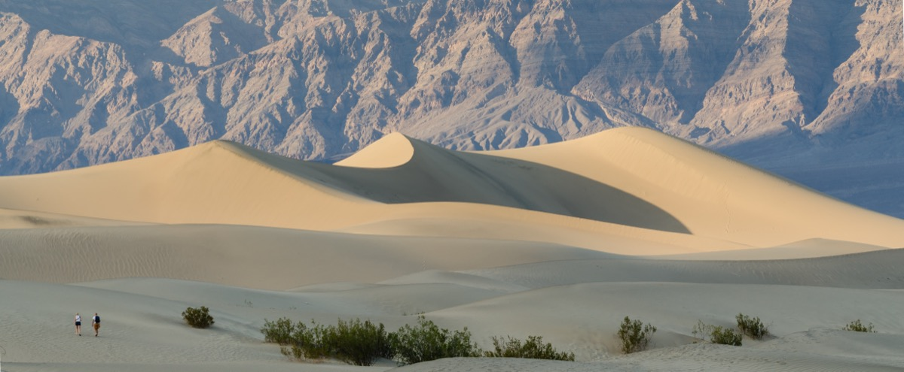
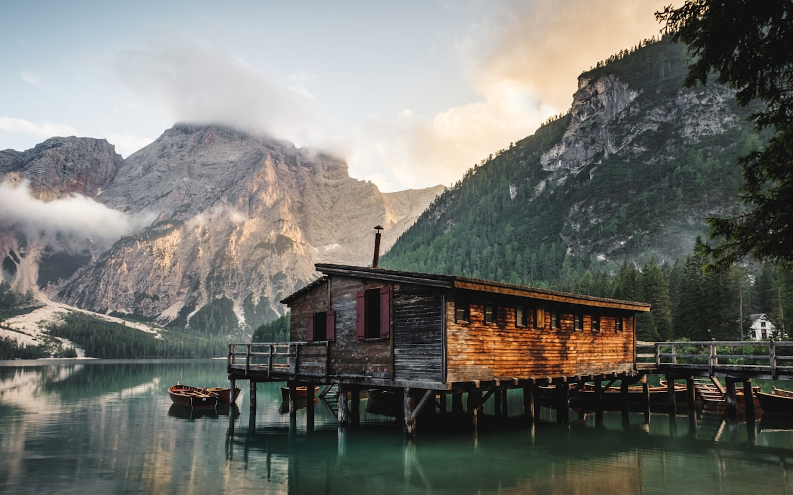
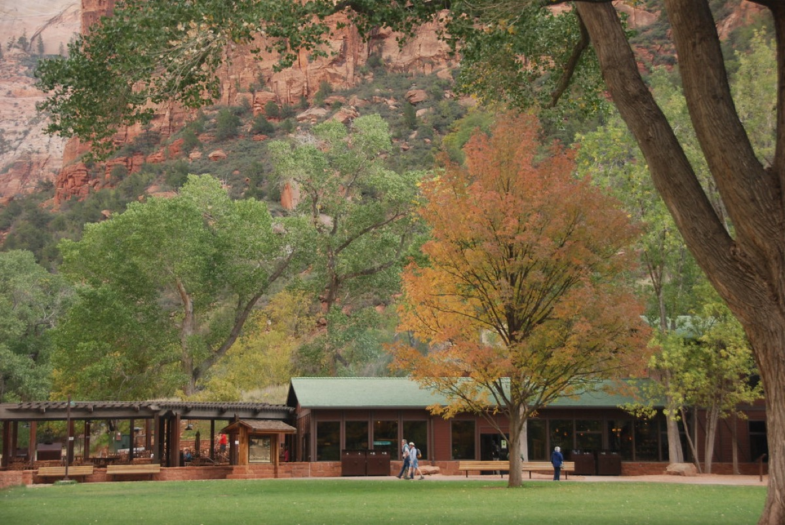
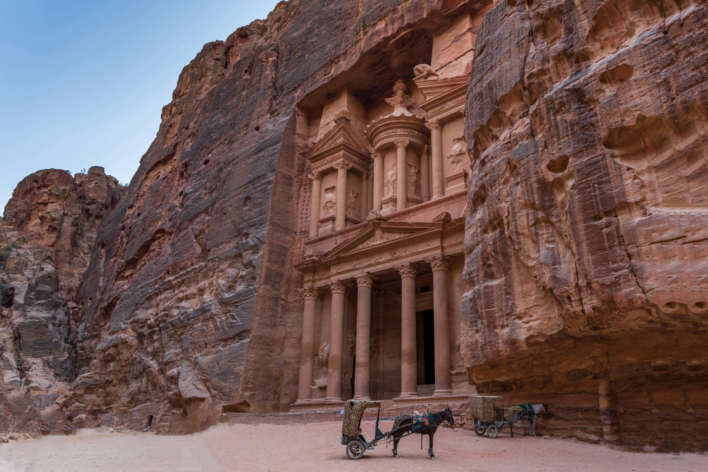
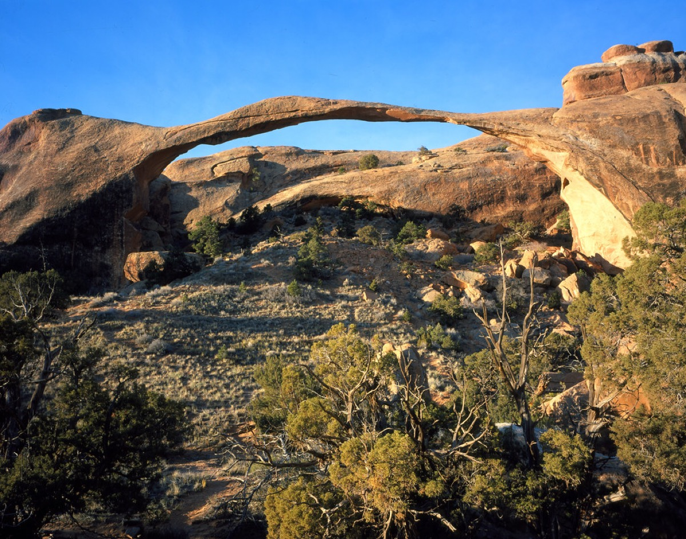
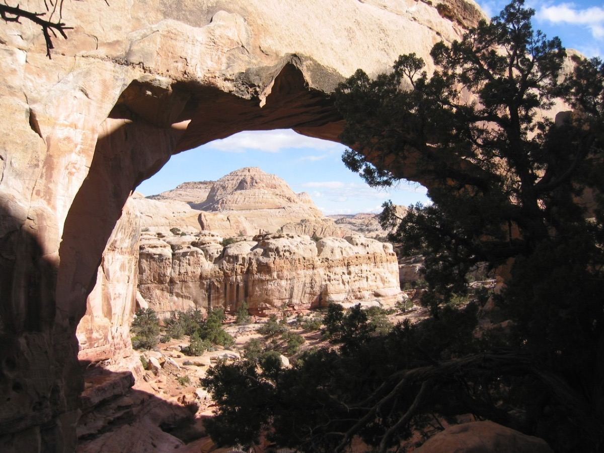
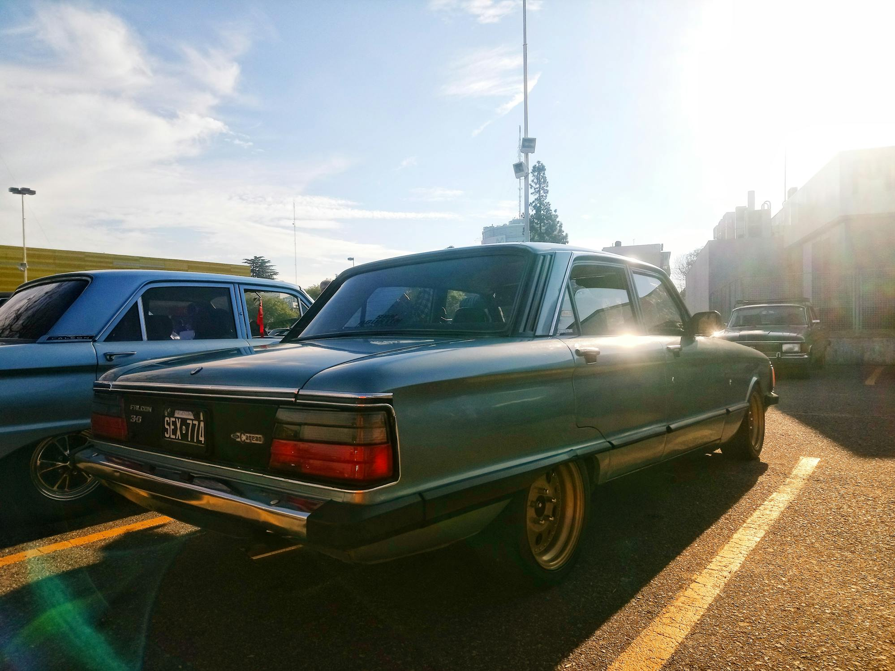

# Route Options - Pre & Post White Rim

All routes start/end in **Santa Cruz, CA**.

**White Rim dates (fixed):** April 12-14, 2026

**Early April Weather Considerations:**
- **Desert areas** (Death Valley, Moab, Valley of Fire): Warm to hot days (70-95°F), cool nights (35-65°F), mostly dry
- **High elevations** (Mammoth, La Sal Mountains): Snow likely, some roads may be closed
- **Transition zones** (Zion, Alabama Hills): Pleasant spring weather (60-75°F), occasional wind
- **Check road status** before departure: Tioga Road, Kings Canyon, La Sal Loop, Cathedral Valley
- **Pack layers** - temperature swings of 40-50°F between day and night are common

---

## 🔵 PRE-WHITE RIM ROUTES (Apr 4-11)

You have **8 days** to get from Santa Cruz to White Rim entry at Mineral Bottom/Hwy 313.

### TL;DR - Pre-White Rim Route Comparison

**Route A: Eastern Sierra Mountain Focus** (~950 mi, 2 rest days)  
High desert + mountains. Alabama Hills, Mammoth hot springs, Zion. Great scenic drives (Kings Canyon, Whitney Portal). **Catch:** Snow likely at high elevations, some roads may be closed.

**Route B: Desert Parks Focus** (~900 mi, 2 rest days)  
Iconic parks. Death Valley, Valley of Fire, Gooseberry Mesa biking, Zion. Tons of scenic drives. **Catch:** Death Valley will be HOT (80-95°F+), limited biking there.

**Route C: Moab-Centric** (~750 mi, 4 rest days)  
Maximum saddle time. Get to Moab fast, ride 4+ days straight (Slickrock, Porcupine, Mag 7, Whole Enchilada). Best weather. **Catch:** Skip other parks, focus is purely on Moab trails.

### Route A: Eastern Sierra Mountain Focus

  
*Alabama Hills, California - BLM official photo*

**Theme:** High desert mountains, scenic camping, moderate biking  
**Total driving:** ~950 miles to Moab  
**Stationary days:** 2

#### Itinerary

**Day 1 (Apr 4) - Santa Cruz → Alabama Hills**
- **Distance:** 300 miles, 5 hours
- **Route:** US-395 south through Owens Valley
- **Optional detour:** Add Kings Canyon via CA-180 (+2-3 hours, stunning canyon drive - check if road is open past Grant Grove in early April)
- **Camp:** BLM dispersed around Alabama Hills (Movie Road, Tuttle Creek)
- **Activities:** Explore Alabama Hills, short sunset ride

**Day 2 (Apr 5) - Alabama Hills (REST DAY)**
- **Camp:** Same spot
- **Activities:** Mountain bike Alabama Hills trails (moderate terrain), explore arches, hike Mt. Whitney Portal area

**Day 3 (Apr 6) - Alabama Hills → Mammoth Area**
- **Distance:** 120 miles, 2.5 hours
- **Camp:** BLM dispersed near Mammoth (Benton Crossing Road area) or Glass Flow
- **Activities:** Explore, setup camp, short ride

**Day 4 (Apr 7) - Mammoth (REST DAY)**
- **Camp:** Same spot
- **Activities:** Mountain bike Mammoth trails (may have some snow at high elevation), hot springs (Wild Willy's, Benton)

**Day 5 (Apr 8) - Mammoth → Zion Area**
- **Distance:** 330 miles, 5.5 hours
- **Route:** US-395 → NV-318 → I-15 → UT-9
- **Camp:** BLM dispersed near Zion (Smithsonian Butte Road) or Hurricane area
- **Activities:** Setup, evening exploration

**Day 6 (Apr 9) - Zion → Moab**
- **Distance:** 200 miles, 3.5 hours
- **Camp:** BLM dispersed near Moab (Hwy 128, Potash Road, Sand Flats area)
- **Activities:** Arrive early afternoon, scout White Rim staging, evening ride

**Day 7-8 (Apr 10-11) - Moab (REST DAYS)**
- **Camp:** Same spot or move to closer staging area
- **Activities:** Mountain bike (Slickrock, Porcupine Rim, Mag 7), prep for White Rim, resupply in town

**Scenic Drives:**
- **Tioga Road (if open)** - Yosemite high country (often closed until May)
- **Kings Canyon Scenic Byway** - 30 miles into Kings Canyon NP, stunning canyon views
- **Whitney Portal Road** - 13 miles from Lone Pine to Mt. Whitney trailhead
- **Rock Creek Road** - Mammoth area, alpine scenery

**Weather (early April):**
- **Alabama Hills:** 60-75°F days, 35-45°F nights, mostly dry
- **Mammoth:** 40-55°F days, 20-30°F nights, snow possible at elevation
- **Zion area:** 65-75°F days, 40-50°F nights
- **Moab:** 60-70°F days, 35-45°F nights

**Pros:** High-elevation scenery, less crowded, good biking, scenic byways  
**Cons:** Snow likely at Mammoth/high elevations in early April, some roads may be closed (check Tioga, Kings Canyon status)

---

### Route B: Desert Parks Focus

  
*Death Valley National Park - Wikimedia Commons*

**Theme:** Death Valley, Nevada desert, iconic landscapes  
**Total driving:** ~900 miles to Moab  
**Stationary days:** 2

#### Itinerary

**Day 1 (Apr 4) - Santa Cruz → Death Valley**
- **Distance:** 400 miles, 6.5 hours
- **Route:** I-5 → CA-58 → CA-178 into Death Valley
- **Camp:** Texas Spring Campground (first-come) or BLM dispersed outside park (near Beatty, NV)
- **Activities:** Evening exploration, Badwater Basin sunset

**Day 2 (Apr 5) - Death Valley (REST DAY)**
- **Camp:** Same spot
- **Activities:** Explore park (Zabriskie Point, Artist's Palette, Mesquite Dunes), limited biking (mostly hiking park)

**Day 3 (Apr 6) - Death Valley → Valley of Fire / Las Vegas Area**
- **Distance:** 160 miles, 2.5 hours
- **Camp:** Valley of Fire State Park (first-come sites) or BLM near park
- **Activities:** Explore Valley of Fire, petroglyph hikes

  
*Valley of Fire State Park - Wikimedia Commons*

**Day 4 (Apr 7) - Valley of Fire (REST DAY)**
- **Camp:** Same spot
- **Activities:** Mountain bike Mouse's Tank area trails, more hiking/photography

**Day 5 (Apr 8) - Valley of Fire → Zion Area**
- **Distance:** 135 miles, 2 hours
- **Camp:** BLM dispersed near Zion (Smithsonian Butte Road, Gooseberry Mesa area)
- **Activities:** Setup camp early, explore Gooseberry Mesa

  
*Zion National Park - NPS official photo*

**Day 6 (Apr 9) - Zion Area (SEMI-REST DAY)**
- **Camp:** Same spot
- **Activities:** Mountain bike Gooseberry Mesa (world-class slickrock), evening scenic drive

**Day 7 (Apr 10) - Zion Area → Moab**
- **Distance:** 200 miles, 3.5 hours
- **Camp:** BLM dispersed near Moab (Sand Flats, Hwy 128, Potash Road)
- **Activities:** Arrive early, scout White Rim entry, resupply

**Day 8 (Apr 11) - Moab (REST DAY)**
- **Camp:** Same spot (close to Mineral Bottom Road staging)
- **Activities:** Mountain bike Moab trails, final White Rim prep

**Scenic Drives:**
- **Artist's Drive** - Death Valley, 9-mile loop through colorful badlands
- **Badwater Road** - Death Valley, to lowest point in North America (-282 ft)
- **Valley of Fire Scenic Loop** - 10-mile loop through red rock formations
- **Zion Canyon Scenic Drive** - 6 miles up canyon (shuttle required during peak season)
- **Kolob Canyons Road** - 5 miles into Zion's northern section

**Weather (early April):**
- **Death Valley:** 80-95°F days, 55-65°F nights, very hot by midday
- **Valley of Fire:** 75-85°F days, 50-60°F nights
- **Zion area:** 65-75°F days, 40-50°F nights
- **Moab:** 60-70°F days, 35-45°F nights

**Pros:** Iconic desert parks, great scenic drives, Gooseberry Mesa biking, Valley of Fire, warm weather  
**Cons:** Death Valley can be HOT in April (potentially 90-100°F by afternoon), limited mountain biking at Death Valley, bring extra water

---

### Route C: Moab-Centric (Maximum Ride Time)

  
*Canyonlands area, Utah - Wikimedia Commons*

**Theme:** Get to Moab faster, spend 4+ days riding world-class trails  
**Total driving:** ~750 miles direct to Moab  
**Stationary days:** 4

#### Itinerary

**Day 1 (Apr 4) - Santa Cruz → Somewhere Central Nevada**
- **Distance:** 400 miles, 6 hours
- **Route:** I-80 east into Nevada
- **Camp:** BLM dispersed (Austin, NV area or Great Basin area)
- **Activities:** Drive day, setup camp, relax

**Day 2 (Apr 5) - Nevada → Moab**
- **Distance:** 350 miles, 5.5 hours
- **Route:** US-50 → I-15 → I-70 → US-191
- **Camp:** BLM dispersed near Moab (Sand Flats Recreation Area preferred for Slickrock access)
- **Activities:** Arrive early afternoon, evening ride

**Day 3-6 (Apr 6-9) - Moab (REST DAYS)**
- **Camp:** Same dispersed spot (or move to different BLM area mid-week)
- **Activities:** 
  - Mountain bike: Slickrock Trail, Porcupine Rim, Whole Enchilada, Mag 7, Klondike Bluffs
  - Explore Arches NP (short hikes between rides)
  - Town resupply/meals
  - Rest/recovery days as needed

  
*Landscape Arch, Arches National Park - NPS official photo*

**Day 7-8 (Apr 10-11) - Moab (Staging Days)**
- **Camp:** Move closer to Mineral Bottom Road entry
- **Activities:** Light riding, final White Rim prep, check vehicle/gear

**Scenic Drives:**
- **Arches Scenic Drive** - 18 miles through Arches NP, world-class rock formations
- **Canyonlands Island in the Sky** - Mesa top roads with expansive canyon views
- **Potash Road (Highway 279)** - 17 miles along Colorado River, petroglyphs and rock art
- **La Sal Mountain Loop** - 60-mile alpine loop (may have snow at top in early April)
- **Castle Valley Scenic Byway** - Red rock towers and mesas

**Weather (early April):**
- **Moab:** 60-70°F days, 35-45°F nights, generally perfect riding weather
- **Occasional rain/wind** but mostly dry
- **Arches/Canyonlands:** Same as Moab, exposed to wind on mesa tops
- **Snow possible** at high elevations (La Sal Mountains)

**Pros:** Maximum time on world-class Moab trails, less driving stress, 4 full riding days, excellent scenic drives, ideal spring weather  
**Cons:** Skips other scenic areas, Nevada camp is just a stopover, can be windy

---

## 🟢 POST-WHITE RIM ROUTES (Apr 15-18)

You have **4 days** to return to Santa Cruz after exiting White Rim on Apr 14.

### TL;DR - Post-White Rim Route Comparison

**Route A: Capitol Reef Loop** (~900 mi, 1 rest day)  
See another park. Capitol Reef scenic drives, Cathedral Valley 4WD option. **Catch:** Long final drive days.

**Route B: Moab Recovery + Direct Return** (~750 mi, 2 rest days)  
Rest up. 2 full days in Moab to recover (shower, spa, brewery, light riding). Fastest way home. **Catch:** Less variety.

**Route C: Goblin Valley Detour** (~800 mi, 1 rest day)  
Two parks. Quick Goblin Valley + Capitol Reef combo. Unique landscapes. **Catch:** More moving around, less rest.

### Route A: Capitol Reef Loop

  
*Capitol Reef National Park - Wikimedia Commons*

**Theme:** See another Utah park, scenic return  
**Total driving:** ~900 miles back to Santa Cruz  
**Stationary days:** 1

#### Itinerary

**Day 1 (Apr 15) - Exit White Rim → Capitol Reef**
- **Distance:** 145 miles, 2.5 hours
- **Route:** Exit Shafer Trail → UT-24 west to Capitol Reef
- **Camp:** Fruita Campground (first-come) or Cathedral Valley dispersed (4WD required)
- **Activities:** Arrive early afternoon, explore Capitol Reef, Hickman Bridge hike

**Day 2 (Apr 16) - Capitol Reef (REST DAY)**
- **Camp:** Same spot
- **Activities:** Scenic drive (Capitol Reef Scenic Drive), Cathedral Valley 4WD loop, light biking or hiking

**Day 3 (Apr 17) - Capitol Reef → Somewhere Central Nevada**
- **Distance:** 350 miles, 5.5 hours
- **Route:** UT-24 → I-70 → US-50
- **Camp:** BLM dispersed (Austin, NV or Ely area)
- **Activities:** Long drive day, setup camp, rest

**Day 4 (Apr 18) - Nevada → Santa Cruz**
- **Distance:** 400 miles, 6 hours
- **Route:** US-50 → I-80 → CA-99 → Santa Cruz
- **Activities:** Drive home, arrive evening

**Scenic Drives:**
- **Capitol Reef Scenic Drive** - 8 miles through orchards and canyons
- **Cathedral Valley Loop** - 60-mile 4WD loop (remote, requires good conditions)
- **Highway 12** (if routing that way) - All-American Road, stunning views

**Weather (mid-April):**
- **Capitol Reef:** 65-75°F days, 40-50°F nights, pleasant spring conditions
- **Cathedral Valley** may be impassable if recent rain

**Pros:** See Capitol Reef (stunning, less crowded than Zion/Arches), excellent scenic drives  
**Cons:** Long drive on Day 3-4, Cathedral Valley requires 4WD and dry conditions

---

### Route B: Moab Recovery + Direct Return

**Theme:** Extra Moab time to recover from White Rim, faster return  
**Total driving:** ~750 miles back to Santa Cruz  
**Stationary days:** 2

#### Itinerary

**Day 1 (Apr 15) - Exit White Rim → Moab**
- **Distance:** 30 miles, 1 hour (from Shafer exit back to Moab)
- **Camp:** BLM dispersed near Moab (Hwy 128, Sand Flats, or in town)
- **Activities:** Shower in town, resupply, recover, light riding if feeling good

**Day 2 (Apr 16) - Moab (REST DAY)**
- **Camp:** Same spot
- **Activities:** Recovery day — hot tub/spa in town, brewery, light ride on easy trails, or full rest

**Day 3 (Apr 17) - Moab → Central Nevada**
- **Distance:** 350 miles, 5.5 hours
- **Route:** I-70 → US-50
- **Camp:** BLM dispersed (Austin, NV or Ely area)
- **Activities:** Drive day, camp setup, rest

**Day 4 (Apr 18) - Nevada → Santa Cruz**
- **Distance:** 400 miles, 6 hours
- **Route:** US-50 → I-80 → Santa Cruz
- **Activities:** Drive home

**Pros:** 2 full days in Moab post-White Rim, shower/recovery time  
**Cons:** Less variety on return, long final 2 drive days

---

### Route C: Goblin Valley Detour

  
*Goblin Valley State Park - Wikimedia Commons*

**Theme:** Quick Goblin Valley visit, different scenery  
**Total driving:** ~800 miles back to Santa Cruz  
**Stationary days:** 1

#### Itinerary

**Day 1 (Apr 15) - Exit White Rim → Goblin Valley**
- **Distance:** 90 miles, 1.5 hours
- **Route:** UT-313 → UT-24 → Goblin Valley Road
- **Camp:** Goblin Valley State Park (first-come sites)
- **Activities:** Explore Goblin Valley hoodoos, sunset photography

**Day 2 (Apr 16) - Goblin Valley → Capitol Reef**
- **Distance:** 55 miles, 1 hour
- **Camp:** Fruita Campground (first-come) or dispersed near Capitol Reef
- **Activities:** Morning Goblin Valley, afternoon Capitol Reef scenic drive

**Day 3 (Apr 17) - Capitol Reef → Central Nevada**
- **Distance:** 350 miles, 5.5 hours
- **Route:** UT-24 → I-70 → US-50
- **Camp:** BLM dispersed (Austin or Ely, NV)
- **Activities:** Long drive day, setup camp

**Day 4 (Apr 18) - Nevada → Santa Cruz**
- **Distance:** 400 miles, 6 hours
- **Activities:** Drive home

**Pros:** See both Goblin Valley and Capitol Reef, unique landscapes  
**Cons:** More moving around, less rest time

---

## Summary Comparison

### Pre-White Rim Routes

| Route | Total Miles | Stationary Days | Mountain Biking Focus | Scenery Variety |
|-------|-------------|-----------------|----------------------|-----------------|
| **A - Eastern Sierra** | ~950 | 2 | Moderate | High mountains, desert |
| **B - Desert Parks** | ~900 | 2 | Low-Moderate | Desert parks, slickrock |
| **C - Moab-Centric** | ~750 | 4 | **HIGH** | Focused on Moab |

### Post-White Rim Routes

| Route | Total Miles | Stationary Days | Highlights |
|-------|-------------|-----------------|------------|
| **A - Capitol Reef** | ~900 | 1 | Capitol Reef scenic drives |
| **B - Moab Recovery** | ~750 | 2 | Recovery time, easy return |
| **C - Goblin Valley** | ~800 | 1 | Goblin Valley + Capitol Reef |

---

## Recommendations

**If you want maximum mountain biking:**
- **Pre:** Route C (Moab-Centric) — 4 days riding Slickrock, Porcupine, Mag 7, etc.
- **Post:** Route B (Moab Recovery) — more time to ride post-White Rim if you're not too tired

**If you want scenic variety:**
- **Pre:** Route A (Eastern Sierra) — mountains, desert, high elevation variety
- **Post:** Route A (Capitol Reef) or C (Goblin Valley) — see different Utah parks

**If you want balance:**
- **Pre:** Route B (Desert Parks) — iconic parks + some riding (Gooseberry Mesa)
- **Post:** Route B (Moab Recovery) — rest days + flexibility

**My take:**
- **Pre-White Rim:** Route C (Moab-Centric) if you're serious about mountain biking. You'll get 4 full days on world-class trails before White Rim.
- **Post-White Rim:** Route B (Moab Recovery). You'll be tired after White Rim. Two days in Moab to recover, then straight home makes sense.

Total trip would be **Santa Cruz → 2 days driving → 4 days Moab riding → 2 days White Rim staging/prep → 2 nights White Rim Trail → 2 days Moab recovery → 2 days driving home**.

Let me know which route(s) appeal and I can refine!
